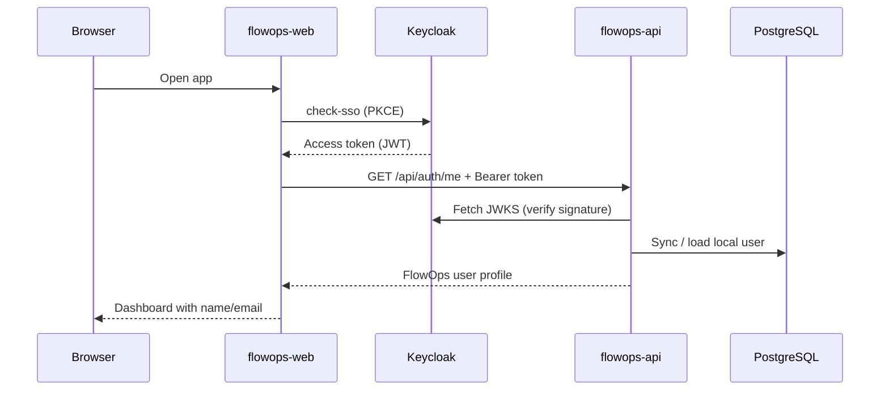

# FlowOps

FlowOps is a full-stack enterprise workflow automation and approval platform for managing internal requests, approvals, audit trails, and multi-step business processes.

## Tech stack

| Layer | Technologies |
| --- | --- |
| Backend | Express.js, TypeScript, Prisma, PostgreSQL, Pino, Zod |
| Frontend | React, TypeScript, Vite, React Router, TanStack Query, Tailwind CSS |
| Infrastructure | Docker Compose, PostgreSQL 16, Keycloak 26, Seq |

## Prerequisites

- [Node.js](https://nodejs.org/) **20.19+**
- [npm](https://www.npmjs.com/) **10+**
- [Docker Desktop](https://www.docker.com/products/docker-desktop/) (recommended) or Docker Engine with Compose

## Repository structure

```text
FlowOps/
├── docker-compose.yml      # Local dev stack (postgres, adminer, keycloak, seq, api, web)
├── .env.example            # Shared Docker Compose environment variables
├── keycloak/realm/         # Keycloak realm import (flowops realm)
├── flowops-api/            # Express.js backend API
└── flowops-web/            # React frontend application
```

## Quick start (Docker Compose)

```bash
cp .env.example .env
docker compose up --build
```

| Service | URL |
| --- | --- |
| Web | http://localhost:5173 |
| API | http://localhost:5000/api |
| API docs | http://localhost:5000/api/docs |
| Keycloak | http://localhost:8080 |
| Keycloak admin console | http://localhost:8080/admin |
| Seq (log viewer) | http://localhost:5341 |
| Adminer (database UI) | http://localhost:8081 |
| PostgreSQL | `localhost:5432` (user/password/db: `flowops`) |

Stop the stack:

```bash
docker compose down
```

Rebuild after dependency or Dockerfile changes:

```bash
docker compose up --build
```

## Local development (Node.js)

Use this when you want hot reload outside Docker containers.

### 1. Start PostgreSQL

```bash
cp .env.example .env
docker compose up -d postgres
```

### 2. Start the API

```bash
cd flowops-api
npm install
cp .env.example .env
npm run db:migrate:deploy
npm run dev
```

### 3. Start the web app

In a separate terminal:

```bash
cd flowops-web
npm install
cp .env.example .env
npm run dev
```

## Keycloak (local development)

FlowOps uses Keycloak for authentication. The `flowops` realm is imported automatically when Keycloak starts through Docker Compose.

### Start Keycloak only

```bash
cp .env.example .env
docker compose up -d keycloak
```

### Admin console

- URL: http://localhost:8080/admin
- Username: value of `KEYCLOAK_ADMIN` (default `admin`)
- Password: value of `KEYCLOAK_ADMIN_PASSWORD` (default `admin`)

Select the **flowops** realm in the top-left realm dropdown.

### Realm and clients

| Item | Value |
| --- | --- |
| Realm | `flowops` |
| Frontend client | `flowops-web` (public, PKCE, redirect `http://localhost:5173/*`) |
| API client | `flowops-api` (confidential, service account enabled) |
| API client secret (dev) | `flowops-api-dev-secret` |

OpenID configuration:

http://localhost:8080/realms/flowops/.well-known/openid-configuration

### Test users

| Username | Password | Roles |
| --- | --- | --- |
| `test.user` | `password` | `user` |
| `admin.user` | `password` | `admin`, `user` |

Use these accounts to sign in at http://localhost:5173.

### Reset Keycloak data

If you need to re-import the realm from scratch:

```bash
docker compose down
docker volume rm flowops_keycloak_data
docker compose up -d keycloak
```

## Authentication

FlowOps uses **Keycloak** for identity and **local PostgreSQL profiles** for application data. Keycloak handles sign-in, tokens, and roles; the API stores a `users` row linked by `keycloakUserId`.

### Why Keycloak?

- Industry-standard OpenID Connect / OAuth 2.0
- Centralized login, logout, and session management
- Realm roles map to FlowOps permissions (`user`, `admin`)
- Same pattern scales to staging and production IdPs

### Architecture



| Layer | Responsibility |
| --- | --- |
| **Keycloak** | Login, JWT access tokens, realm roles |
| **flowops-web** | PKCE login via `keycloak-js`, attach Bearer token to API calls |
| **flowops-api** | Verify JWT, sync Keycloak user to `users` table, return profile |
| **PostgreSQL** | Persist local user id, email, firstName, lastName |

### Frontend login flow

1. User opens http://localhost:5173 and clicks **Sign in**.
2. Browser redirects to Keycloak (`flowops-web` public client, PKCE S256).
3. After login, Keycloak redirects back with an authorization code; `keycloak-js` exchanges it for tokens.
4. `AuthProvider` registers a token getter used by the API client.
5. On successful authentication, the app calls **`GET /api/auth/me`** and stores the returned FlowOps profile in auth context.
6. Protected routes (`/dashboard`, `/workflows`, etc.) require an active Keycloak session.

### Backend token verification

Protected API routes use middleware in this order:

1. **`authenticate`** — reads `Authorization: Bearer <token>`, verifies JWT signature via Keycloak JWKS, checks issuer and `azp` (`flowops-web`).
2. **`ensureLocalUser`** — creates or updates the local `users` row from token claims; sets `req.localUser`.
3. **Controller** — returns the synced profile.

Public routes (no token): `/api/health`, `/api/logs/client`.

### Local user profile sync

On each authenticated request through `ensureLocalUser`, the API upserts a row in `users`:

| Field | Source |
| --- | --- |
| `keycloakUserId` | JWT `sub` |
| `email` | JWT `email` (fallback: `{username}@flowops.local`) |
| `firstName` / `lastName` | JWT `given_name` / `family_name`, or parsed from `name` |

`GET /api/auth/me` returns the local id plus Keycloak session roles:

```json
{
  "success": true,
  "message": "Current user retrieved successfully",
  "data": {
    "id": "flowops-user-id",
    "keycloakUserId": "keycloak-user-id",
    "email": "test.user@flowops.local",
    "firstName": "Test",
    "lastName": "User",
    "username": "test.user",
    "roles": ["user"],
    "createdAt": "2026-06-08T21:10:44.388Z",
    "updatedAt": "2026-06-08T21:10:44.388Z"
  }
}
```

### Testing with Swagger

1. Sign in at http://localhost:5173.
2. On the home page **Authentication** card, click **Copy token for Swagger** (dev only).
3. Open http://localhost:5000/api/docs → **Authorize** → paste the token (no `Bearer` prefix).
4. Call **GET /api/auth/me**.

**Docker note:** if token verification returns 401, recreate the API container so it picks up `KEYCLOAK_JWKS_URI`:

```bash
docker compose up -d --force-recreate api
```

The API validates tokens against issuer `http://localhost:8080/realms/flowops` but fetches signing keys from `http://keycloak:8080/...` inside Docker.

### Authentication environment variables

| Variable | Used by | Description |
| --- | --- | --- |
| `VITE_KEYCLOAK_URL` | Web | Keycloak base URL |
| `VITE_KEYCLOAK_REALM` | Web | Realm name (`flowops`) |
| `VITE_KEYCLOAK_CLIENT_ID` | Web | Public client (`flowops-web`) |
| `KEYCLOAK_ISSUER` | API | Expected JWT issuer URL |
| `KEYCLOAK_JWKS_URI` | API | JWKS endpoint (Compose sets internal `keycloak` host) |
| `KEYCLOAK_CLIENT_ID` | API | Expected `azp` claim (`flowops-web`) |

## Logging (Seq)

FlowOps uses [Seq](https://datalust.co/seq) for centralized structured log viewing during local development — similar to a typical .NET + Seq setup.

The API already logs with **Pino**. When `SEQ_SERVER_URL` is configured, logs are forwarded to Seq automatically (stdout logging continues as well).

The React frontend sends structured logs to `POST /api/logs/client`, which the API forwards to Seq with `service = 'flowops-web'`. Browser console output is mirrored locally for development.

### Start Seq

Seq starts with the full stack via `docker compose up`, or on its own:

```bash
docker compose up -d seq
```

Open http://localhost:5341 to search, filter, and inspect logs.

Useful filters:

| Filter | Shows |
| --- | --- |
| `origin = 'api'` | All backend logs |
| `origin = 'ui'` | All frontend logs |
| `service = 'flowops-api'` | API service logs |
| `service = 'flowops-web'` | Web app logs |
| `event = 'http.request'` | API HTTP requests |
| `area = 'auth'` | Authentication events (UI) |
| `@Level = 'Error'` | Errors only |

Example messages you will see:

- `[API] GET /api/health returned 200 in 4ms`
- `[UI][auth] User signed in via Keycloak`
- `[UI][health] API health check succeeded (ok)`

Structured fields include `origin`, `event`, `area`, `httpMethod`, `httpPath`, `httpStatus`, and `durationMs`.

### Reset Seq data

```bash
docker compose down
docker volume rm flowops_seq_data
docker compose up -d seq
```

## Environment variables

Docker Compose reads from the **repo root** `.env` file. Local Node.js development uses package-level `.env` files.

### Root `.env` (Docker Compose)

| Variable | Description | Default |
| --- | --- | --- |
| `POSTGRES_VERSION` | PostgreSQL Docker image tag | `16-alpine` |
| `POSTGRES_USER` | Database user | `flowops` |
| `POSTGRES_PASSWORD` | Database password | `flowops` |
| `POSTGRES_DB` | Database name | `flowops` |
| `POSTGRES_PORT` | Host port for PostgreSQL | `5432` |
| `ADMINER_VERSION` | Adminer Docker image tag | `4.8.1` |
| `ADMINER_PORT` | Host port for Adminer | `8081` |
| `KEYCLOAK_VERSION` | Keycloak Docker image tag | `26.0.7` |
| `KEYCLOAK_PORT` | Host port for Keycloak | `8080` |
| `KEYCLOAK_ADMIN` | Keycloak admin username | `admin` |
| `KEYCLOAK_ADMIN_PASSWORD` | Keycloak admin password | `admin` |
| `KEYCLOAK_REALM` | FlowOps realm name | `flowops` |
| `NODE_ENV` | API runtime environment | `development` |
| `PORT` | API port | `5000` |
| `API_PREFIX` | API route prefix | `/api` |
| `LOG_LEVEL` | Pino log level | `info` |
| `CORS_ORIGINS` | Allowed frontend origins | `http://localhost:5173` |
| `SEQ_VERSION` | Seq Docker image tag | `2024.3` |
| `SEQ_PORT` | Host port for Seq UI and ingestion | `5341` |
| `SEQ_SERVER_URL` | Seq URL for API log forwarding | `http://localhost:5341` |
| `KEYCLOAK_ISSUER` | Expected JWT issuer for API verification | `http://localhost:8080/realms/flowops` |
| `KEYCLOAK_JWKS_URI` | JWKS URL (set automatically in Docker Compose) | `{KEYCLOAK_ISSUER}/protocol/openid-connect/certs` |
| `KEYCLOAK_CLIENT_ID` | Expected JWT client id (`azp`) | `flowops-web` |
| `VITE_API_BASE_URL` | Frontend API base URL | `http://localhost:5000/api` |
| `VITE_KEYCLOAK_URL` | Keycloak base URL for the web app | `http://localhost:8080` |
| `VITE_KEYCLOAK_REALM` | Keycloak realm | `flowops` |
| `VITE_KEYCLOAK_CLIENT_ID` | Keycloak public client ID | `flowops-web` |
| `VITE_CLIENT_LOGGING` | Forward frontend logs to Seq via the API | `true` |

See [flowops-api/.env.example](./flowops-api/.env.example) and [flowops-web/.env.example](./flowops-web/.env.example) for local development.

## Database browser (Adminer)

Adminer provides a lightweight web UI for browsing PostgreSQL during local development.

Start it with the full stack (`docker compose up`) or on its own:

```bash
docker compose up -d postgres adminer
```

Open http://localhost:8081 and sign in with:

| Field | Value |
| --- | --- |
| System | **PostgreSQL** |
| Server | **postgres** |
| Username | value of `POSTGRES_USER` (default `flowops`) |
| Password | value of `POSTGRES_PASSWORD` (default `flowops`) |
| Database | value of `POSTGRES_DB` (default `flowops`) |

Use **`postgres`** as the server hostname (the Docker service name), not `localhost`. Adminer runs inside the Compose network and connects to PostgreSQL over the internal network.

## Database commands

Run from `flowops-api`:

```bash
npm run db:migrate        # create and apply a new migration (development)
npm run db:migrate:deploy # apply existing migrations
npm run db:seed           # seed default permissions (idempotent)
npm run db:generate       # regenerate Prisma client
npm run db:studio         # open Prisma Studio
```

## Testing and quality checks

### API

```bash
cd flowops-api
npm test
npm run lint
npm run typecheck
```

### Web

```bash
cd flowops-web
npm run lint
npm run typecheck
npm run build
```

## Docker production builds

```bash
docker build -t flowops-api ./flowops-api --target production
docker build -t flowops-web ./flowops-web --target production
```

## Package documentation

- [flowops-api/README.md](./flowops-api/README.md)
- [flowops-web/README.md](./flowops-web/README.md)
